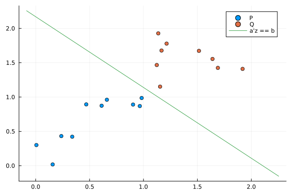

# SeparatingHyperplanes

[](https://dev10110.github.io/SeparatingHyperplanes.jl/stable/)
[](https://dev10110.github.io/SeparatingHyperplanes.jl/dev/)
[](https://github.com/dev10110/SeparatingHyperplanes.jl/actions/workflows/CI.yml?query=branch%3Amain)


Given two sets of points `P`, `Q`, this package exports the function 

```
using SeparatingHyperplanes

# create two 2D pointclouds
P = rand(10, 2) 
Q = 1.1 * ones(10, 2) + rand(10, 2)

# find a separating hyperplane
result = separating_hyperplane(P, Q)

# get the results
status = result.status
a, b = result.a, result.b
```


Such that the hyperplane   `a z = b` separates the points, if one exists. The `status` field defines whether the points can be separated. 



See the documentation for additional details. 